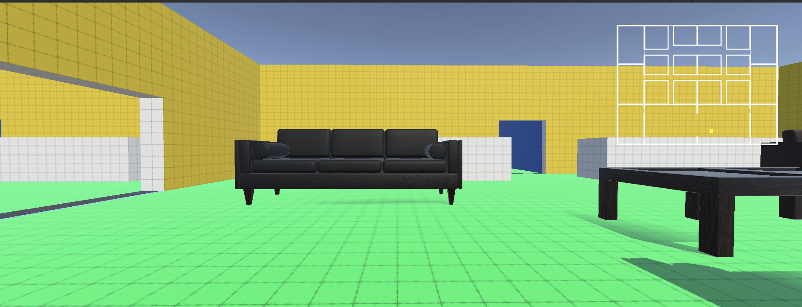

_At the time of writing, I am waiting on my Apple Developer account to proceed beyond pending status._

The game now features a minimap. I spent a bit of time working through several tutorials before finding one that seemed like a good fit.

Using Unity's official tutorials, I worked through building and (local) publishing the game for iOS. I needed to sign up for an Apple Developer account, then follow a few additional steps. I'm current awaiting the approval of my Apple Developer account.

TODO: 
- an in-game menu system to click and navigate throughout the game world, rather than using typical controls.
- load content onto iPad/iPhone
- add music and sound effects
- a startup menu
