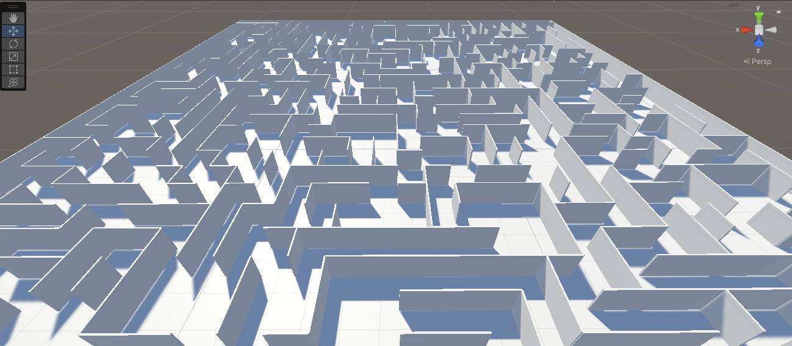
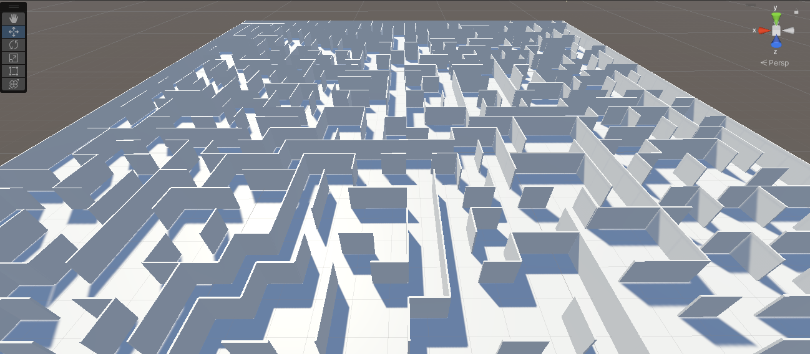
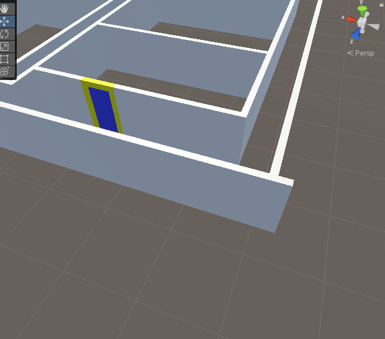

_This post is dated as April 1, 2023 merely to make it earlier than actual updates._

I am using Unity 2021.3.20f1, as it is the most recent LTS build. I prefer LTS builds of products when creating content with a purpose as LTS builds seem to offer some stability and fewer changes.

## Level Design
Starting out, one of the first efforts was to learn to create a maze in Unity to help with designing the level. In an early build I worked through a tutorial for generating a random maze, which looked nice. While the maze had a nice appearance, it would make the objectives of the game overly complicated as the level is randomly generated at the start of each run of the game. 

Random Maze Generator 1

Random Maze Generator 2

I then took the shape creation methods that I learned while working on the maze to construct a level. While this technically worked, managing the sizes and alignment of the shapes (which would be the walls, floors, etc.) was difficult. I wanted to find a way to set precise sizes. Around this time I also put some effort into learning to work with doors, but decided to come back to it after I had the core level structure in place.

Grid Alignment

Searching for methods of precisely controlling the sizes of my shapes, I encountered mention of the ProBuilder feature in many of the forums that I visited. Most of the post were older, and associated with early versions of Unity. THe procedures for getting ProBuilder added were no longer accurate. After some time I learned the procedure for getting ProBuilder added to my Unity (2021.3.20f1) environment.

Two of the resources that helped me to get started were Unity's learn.unity.com site and a tutorial by Brackeys, [MAKING YOUR FIRST LEVEL in Unity with ProBuilder!](https://www.youtube.com/watch?v=YtzIXCKr8Wo).

The level is loosely based on the layout of Lutherville Physicians, which is a semi-symmetrical medical hub for Mercy Hospital in Baltimore. Due to the semi-symmetrical layout, I built half of the level and mirrored the other half once the main structure was completed.

## Player Controller

The next big hurdle was to add a player.

_The sleep has come for me; I'll add more info soon._

## Assets
I knew of the Unity Asset Store due to my work as a lab manager who supports University of Baltimore's game design program. Aside from needing to preload a package on all systems some years ago, this was my first interaction with the asset store. I was suprised by the range of content that was freely available, as well as the cost of premium content.